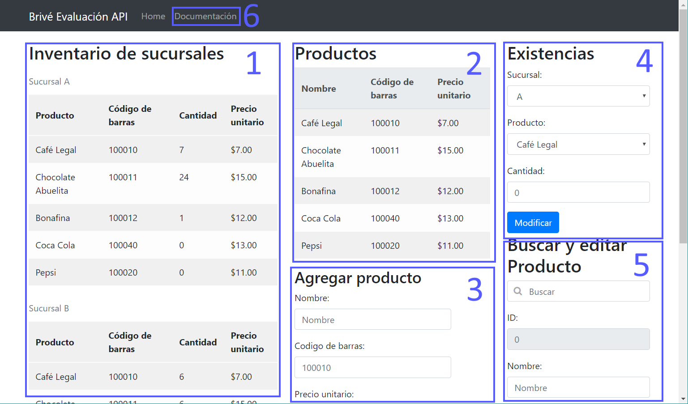
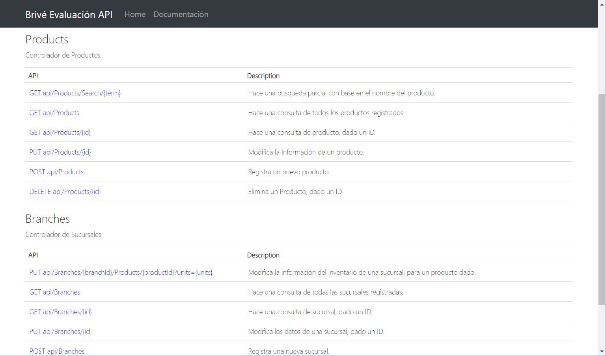

## Cliente

En esta pantalla se pueden observar, de izquierda a derecha:

 - El inventario en todas las sucursales [1], ordenable haciendo click en el encabezado de cada columna, ademas de una forma para agregar una nueva sucursal.
 - Todos los productos registrados, con sus precios unitarios [2]. Al dar click en el encabezado de cada columna se pueden reordenar sus contenidos.
 - Una forma para agregar un nuevo producto [3].
 - Una forma para agregar inventario de productos a una sucursal, en la cual se deben seleccionar la sucursal y el producto deseado, ademas de la cantidad (positiva o negativa) en el cambio de inventario [4].
 - Un campo de búsqueda que nos permite editar o borrar un producto [5]. 

Así mismo, se incluye un vinculo en la parte superior con un enlace a la documentación de la API [6], donde se describen todos los posibles verbos REST, y el formato de petición y respuesta.

## Server

* El código de la api se encuentra en el proyecto brive_ex, en la ruta [`brive_ex/Controllers/`](brive_ex/Controllers/), se encuentran los controladores `BranchesController.cs` y `ProductsController.cs`.
* El DataModel es parte del proyecto `brive_DataAccess`, en la ruta [`brive_DataAccess/`](brive_DataAccess/), las clases `Branch.cs`, `Product.cs`, y `Inventory.cs`.
* La definicion de base de datos ER se encuentra en la ruta [`docs/files/db.sql`](docs/files/db.sql).
* El archivo de base de datos se encuentra en la ruta `brive_ex/App_Data/brive_db.mdf`.

### Error con roslyn/csc.exe
El error en el que no se puede encontrar `bin/roslyn/csc.exe` se debe a un bug con el metodo build del compilador, especialmente cuando se carga un repositorio y se trata de correr la solución.
Existen dos posibles soluciones:
#### 1. Hacer `unload` -> `reload` -> `rebuild` al proyecto brive_ex
Esto copiará los archivos del compilador net dinámico roslyn al directorio bin.
#### 2. Desinstalar el paquete NuGet `Microsoft.Net.Compilers` e instalarlo de nuevo, usando  NuGet Package Manager, en el proyecto brive_ex.
Esto también copiará los archivos necesarios al directorio bin.